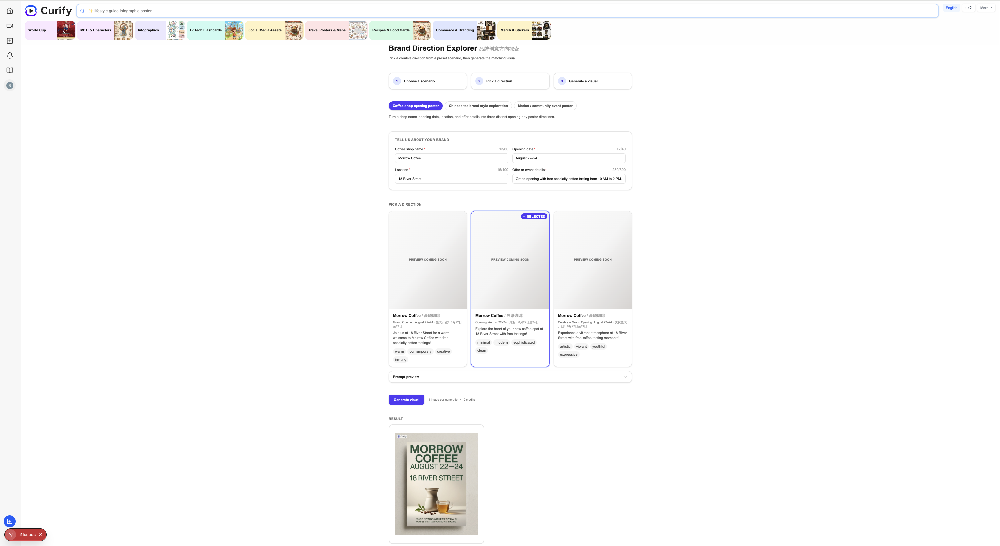
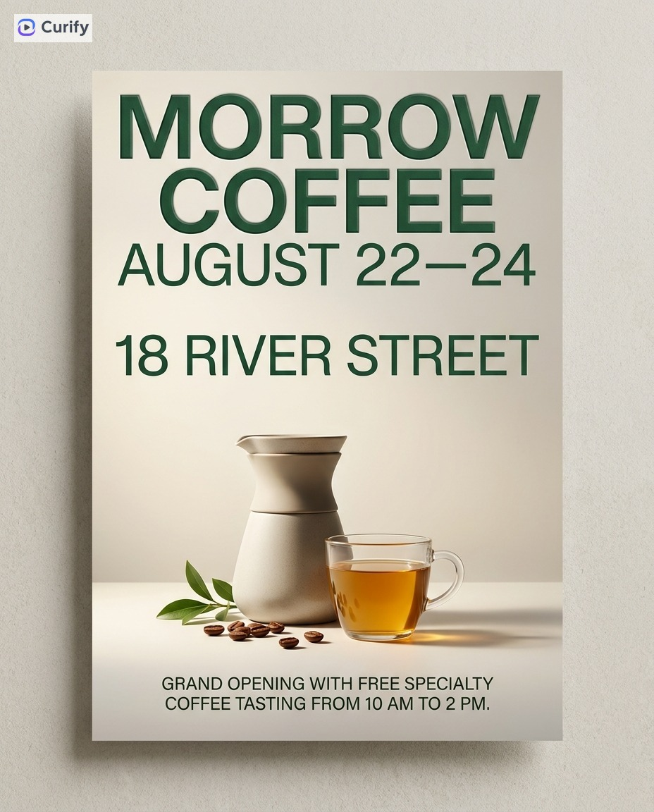
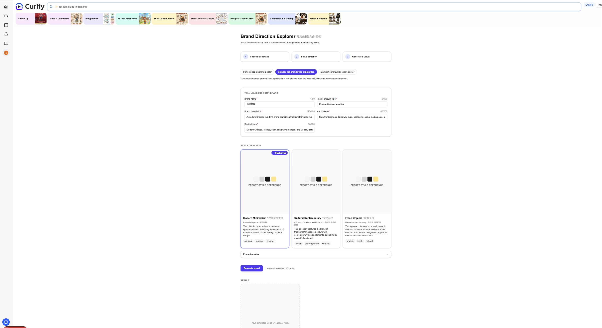
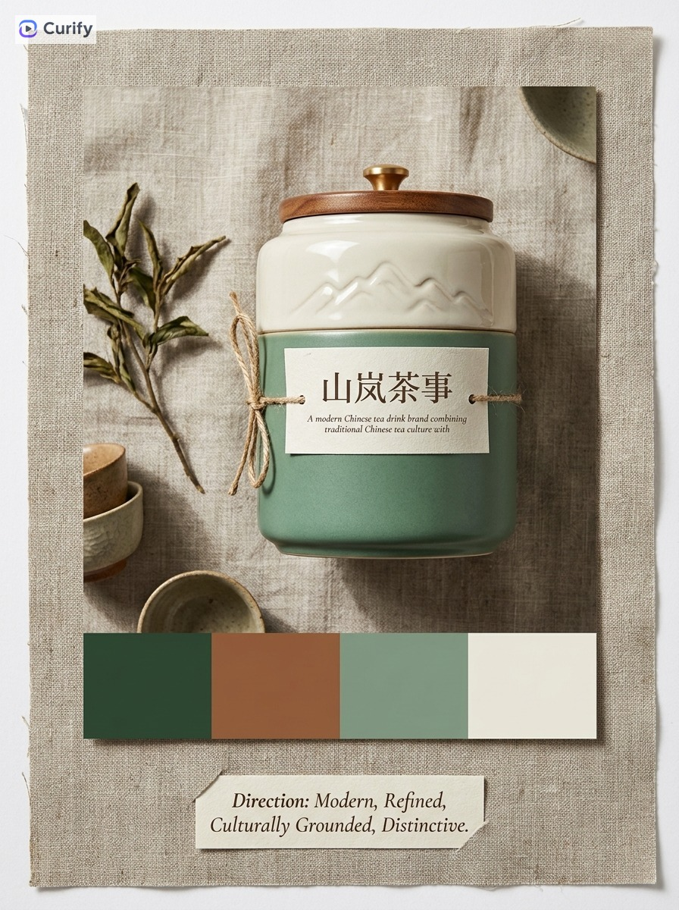
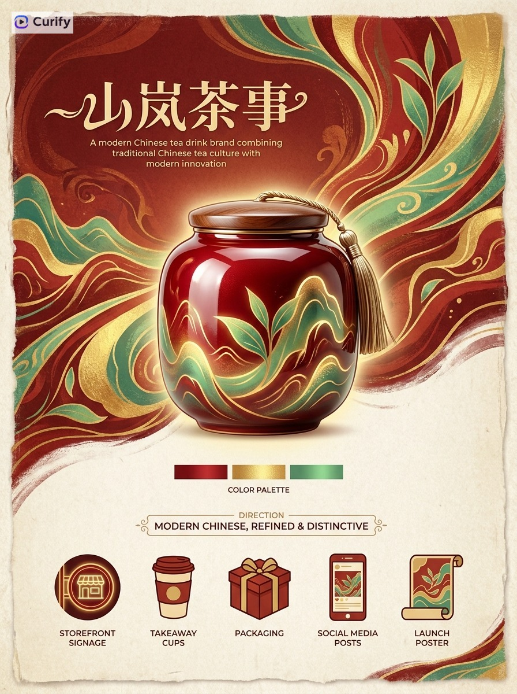
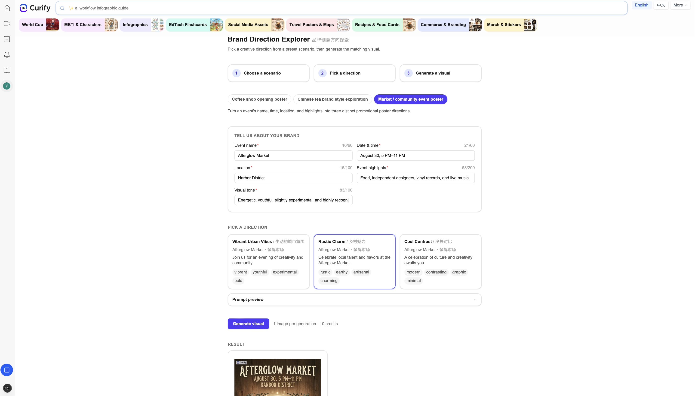
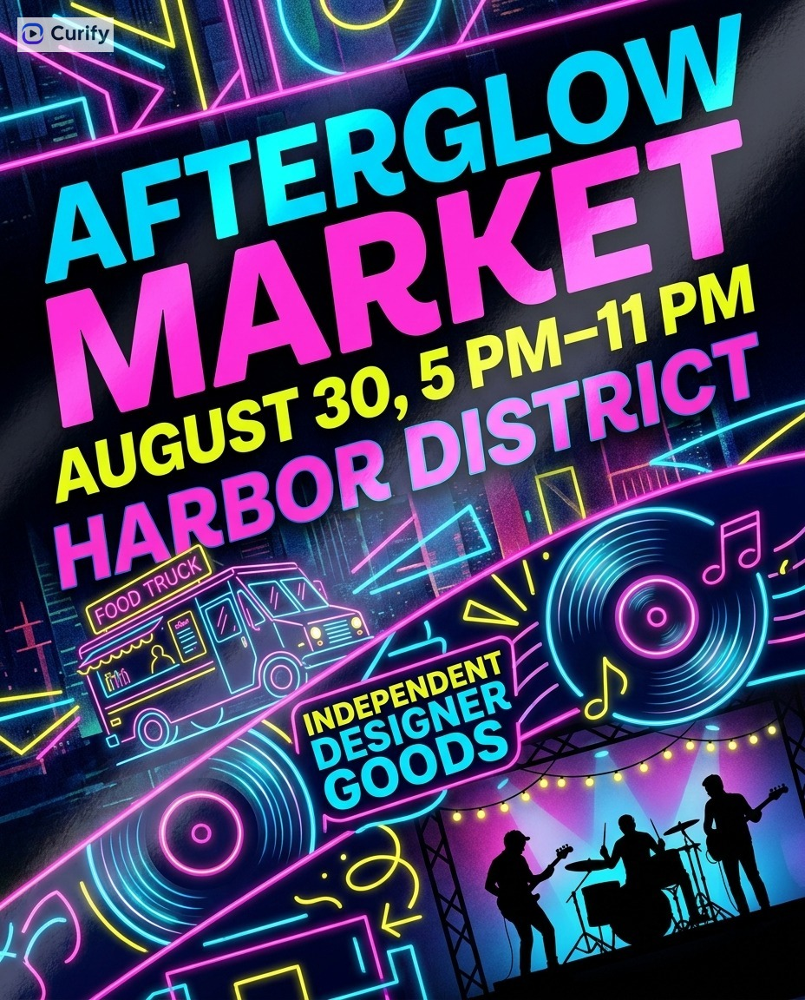
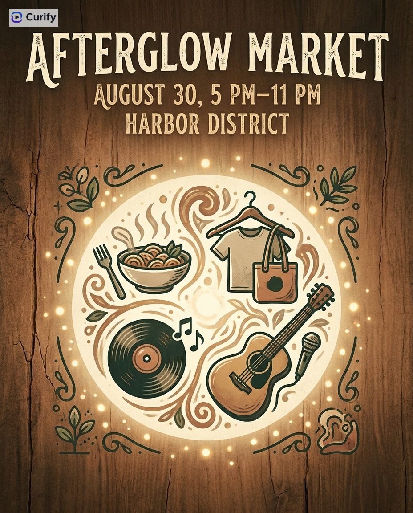

# Brand Direction Explorer — Real-Effect Validation

**Date:** 2026-08-07
**Branch:** `baobao/brand-direction-explorer-tool-demo-2026-08-04`
**Full report:** [FINAL_REPORT.md](./FINAL_REPORT.md)

## Task objective

Replace the Brand Direction Explorer's Stage 1 (creative-direction generation)
from a hand-curated, static list of directions to a real, live OpenAI call —
then validate the change with three real end-to-end runs against the actual
Next.js dev server, not mocks.

## Implementation summary

- Added `lib/brandDirectionOpenAI.ts` — a server-only module (`import
  "server-only"`) that calls OpenAI's `gpt-4o-mini` to generate exactly three
  bilingual (en/zh) creative directions per request, with retry-on-malformed-JSON,
  timeout handling, and sanitized failure messages. This is the **only**
  module in the codebase that talks to OpenAI for this feature.
- Added `app/api/brand-direction-explorer/directions/route.ts` — the only
  caller of `brandDirectionOpenAI.ts`. Validates the request against each
  case's own field metadata (reusing `lib/brand_direction_explorer.ts`, no
  separate schema) and returns `{ success, directions }` or a sanitized
  error.
- Reworked `lib/brand_direction_explorer.ts` to drop all static direction
  content (previously hand-written directions per case) in favor of
  case/field metadata used to build the OpenAI prompt. Also added a
  `brandDescription` field to the tea case (see [known limitations](#known-limitations)
  below).
- Reworked `BrandDirectionExplorerClient.tsx` to fetch directions from the
  new API route (debounced on field changes), show a loading/error state,
  and render whatever directions come back instead of a static id-keyed set.
- Updated both test suites accordingly.

Stage 2 (the final poster/image render) was **not changed** — it continues
to call the existing Gemini-backed Curify image-generation backend via
`services/useFreeformGenerate.ts`, unrelated to this OpenAI work.

## Workflow

1. **Stage 1 — creative directions (this change, OpenAI gpt-4o-mini):** the
   user fills in a case's fields (e.g. shop name, opening date, offer
   details) in the browser UI. The client debounces and POSTs to
   `/api/brand-direction-explorer/directions`, which validates input and
   calls `generateCreativeDirections()` in `lib/brandDirectionOpenAI.ts`.
   OpenAI returns exactly three bilingual directions (title, subtitle,
   description, style tags, and an image-prompt modifier), rendered as
   three cards in the UI.
2. **Stage 2 — final image (unchanged, existing Gemini-backed backend):**
   the user picks one of the three directions; the app calls the existing
   Curify image-generation backend (`useFreeformGenerate`), which renders
   the final poster/visual. This path was not touched by this work and was
   run manually by the user in the browser for each case below.

## Visual index

| # | Case | Stage 1 directions | Primary result | Alternative result |
|---|------|--------------------|-----------------|---------------------|
| 01 | [Morrow Coffee](./01-morrow-coffee/) (coffee-opening) | [screenshot](./01-morrow-coffee/stage1-directions-full-page.png) · [json](./01-morrow-coffee/stage1-directions.json) | [image](./01-morrow-coffee/generated-output-primary.jpg) | [image](./01-morrow-coffee/generated-output-alternative.jpg) |
| 02 | [山岚茶事 / Shanlan Tea](./02-shanlan-tea/) (tea-brand-exploration) | [screenshot (corrected)](./02-shanlan-tea/stage1-directions-full-page-corrected.png) · [json](./02-shanlan-tea/stage1-directions.json) | [image](./02-shanlan-tea/generated-output-primary.jpg) | [image](./02-shanlan-tea/generated-output-alternative.jpg) |
| 03 | [Afterglow Market](./03-afterglow-market/) (event-poster) | [screenshot](./03-afterglow-market/stage1-directions-full-page.png) · [json](./03-afterglow-market/stage1-directions.json) | [image](./03-afterglow-market/generated-output-primary.jpg) | [image](./03-afterglow-market/generated-output-alternative.jpg) |

### 01 — Morrow Coffee (coffee-opening)

Stage 1 — 3 OpenAI-generated directions (warm-invitation, minimalistic-appeal, artistic-collage):

Stage 2 — final images (existing Gemini-backed Curify backend):

| Primary | Alternative |
|---|---|
|  |  |

### 02 — 山岚茶事 / Shanlan Tea (tea-brand-exploration)

Stage 1 — 3 OpenAI-generated directions (modern-minimalism, earthy-elegance, contemporary-vibrance), corrected run after the five-field schema fix (see [known limitations](#known-limitations)):

Stage 2 — final images (existing Gemini-backed Curify backend):

| Primary | Alternative |
|---|---|
|  |  |

### 03 — Afterglow Market (event-poster)

Stage 1 — 3 OpenAI-generated directions (vibrant-abstract, retro-vinyl, minimalist-geometric):

Stage 2 — final images (existing Gemini-backed Curify backend):

| Primary | Alternative |
|---|---|
|  |  |

## Validation summary

- 54/54 unit tests passed (`vitest run --config vitest.unit.config.ts`).
- `npm run build` passed (exit 0).
- Three real, live cases run end-to-end against the local dev server
  (`POST http://localhost:3000/api/brand-direction-explorer/directions`,
  each returning HTTP 200 with real OpenAI round-trip latency of ~8.6–10.6s).
- Every case returned exactly three directions with unique ids and no
  static fallback content (verified: `lib/brand_direction_explorer.ts`
  carries no direction content for any case).
- Two Stage 2 final-image variants (primary + alternative) retained per
  case, generated by the user through the existing browser UI against the
  Gemini-backed backend.
- No secret values (API keys, cookies, credentials, authorization headers)
  appeared in any terminal or browser output during any of the three runs.

**Important — what "Stage 1" and "Stage 2" mean here:**
- **Stage 1 (creative directions):** generated by **OpenAI (`gpt-4o-mini`)** —
  this is the change validated in this report.
- **Stage 2 (final images):** generated by the **existing Gemini-backed
  Curify image-generation backend** (unchanged, pre-existing
  `/nano-freeform/generate` path). The final images in this report were
  **not** generated by OpenAI.

## Known limitations

- **Tea case field-schema gap (fixed mid-run):** the tea case originally
  had only two input fields (brand name, product type — 80 chars max) and no
  field for a longer brand description. The first attempt on the tea case
  put a long brief into the 80-char `productType` field and correctly failed
  client-side validation before any OpenAI call was made (zero API cost).
  Fixed by adding a `brandDescription` field (400 chars max) to
  `lib/brand_direction_explorer.ts` and re-running; see
  [FINAL_REPORT.md](./FINAL_REPORT.md) for the full sequence.
- **Repeated titles on some runs:** in the Morrow Coffee run, all three
  returned directions shared the same `title.en` ("Morrow Coffee"), differing
  only in subtitle/style tags. This is a content-quality gap, not a
  validation failure — the schema only requires a non-empty bilingual title,
  not that titles differ from each other or from the input. Worth a future
  prompt-tuning pass.
- **Stage 2 selection not independently verified:** for all three cases,
  which of the three Stage 1 directions was used to produce each Stage 2
  image (and whether the two images came from two separate direction
  selections vs. one generation + one regenerate) was not directly observed
  via this session's own API calls — it is documented based on the user's
  description and visual inspection of the resulting images.
- **`npm run lint` did not run cleanly**, blocked by a pre-existing ESLint
  configuration mismatch in the repository (unrelated to this change — see
  [FINAL_REPORT.md](./FINAL_REPORT.md)).
